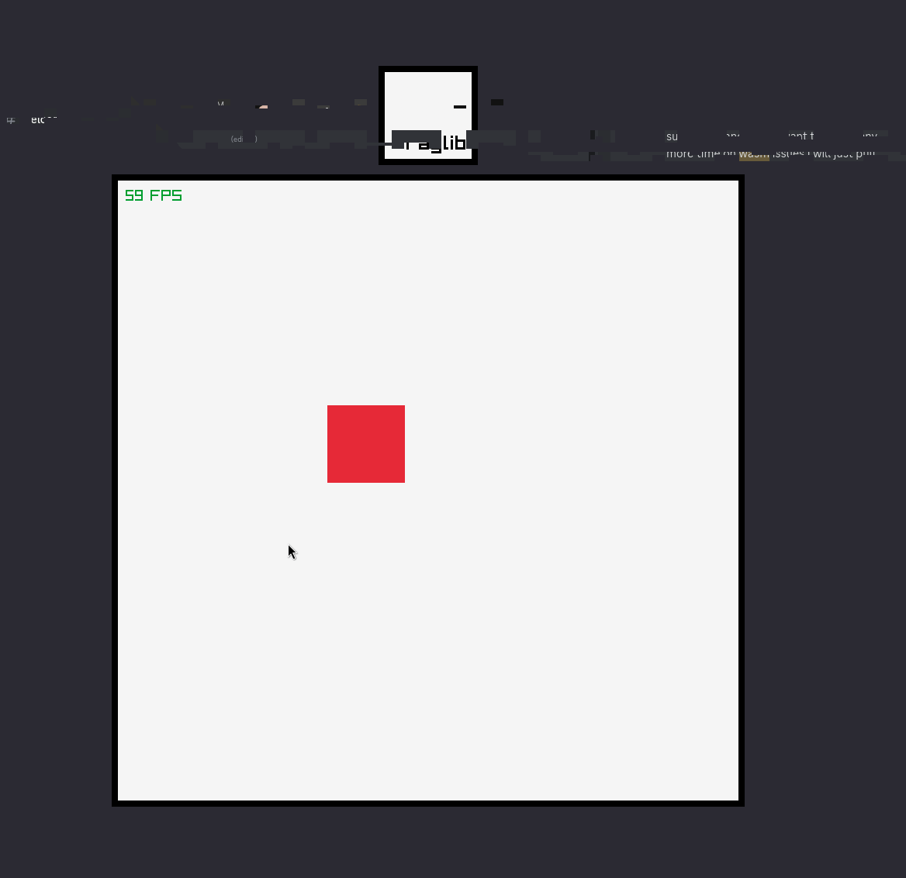

# odin raylib web starter

A template for using Odin + Raylib on the web **and** normal desktop builds at the same time. 

The web part is based on [@Caedo/raylib_wasm_odin](https://github.com/Caedo/raylib_wasm_odin/tree/master), check out the repository for an explanation about some of the limitations of this approach.

**NOTE**: Not sure if this works on anything but Linux, because I build the libraylib.a that is checked in myself
**NOTE**: This project vendors the vendor:raylib library locally under libs/raylib

## Usage

The idea for editing this project is that you leave the web package alone and work with the game package.

### Web

You need to have the latest emsdk installed (emcc should be available in PATH) and then you just run ``make build-web`` and there is a web build available in out/debug/web

### Desktop

Just use ``make run``

## License

MIT
